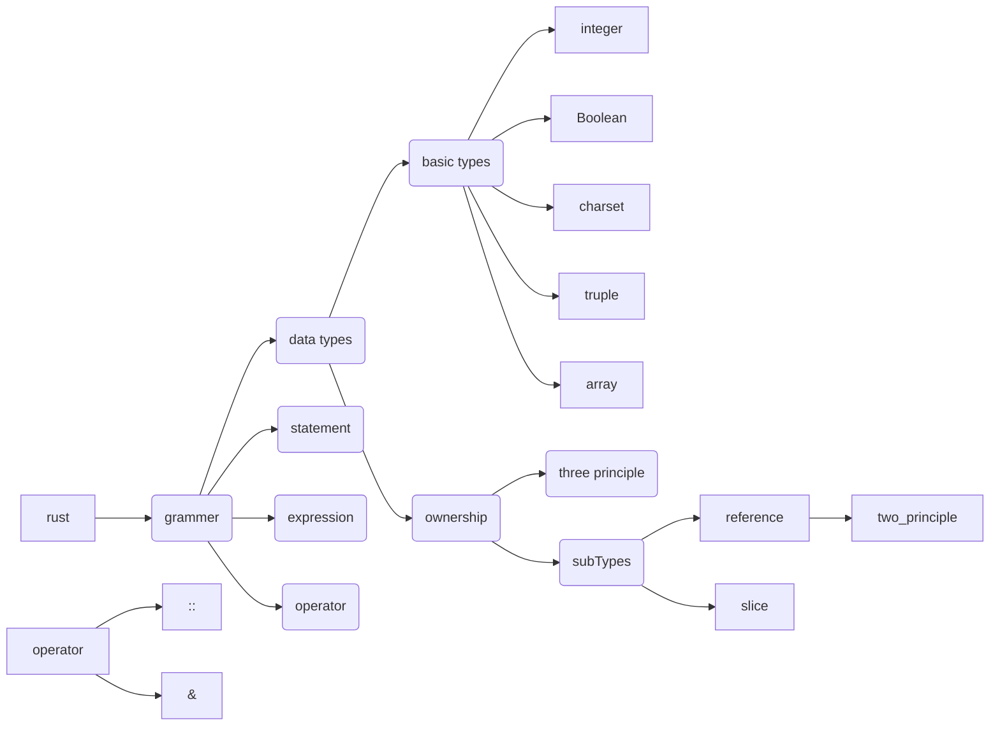

# rust
Get basic computer knowledge by learning rust

no plan , no rules , all just for interest and dull life

# progress

```mermaid
   graph LR
   rust--> A(grammer) 
   A-->B(data types)
   A-->E(statement)
   A-->F(expression)
   A-->G(operator)
   B-->C(basic types)
   B-->D(ownership)
   C-->integer
   C-->Boolean
   C-->charset
   C-->truple
   C-->array
   D-->H(three principle)
   D-->I(subTypes)
   I-->reference
   I-->slice
   reference-->two_principle
   operator-->::
   operator-->&
```

